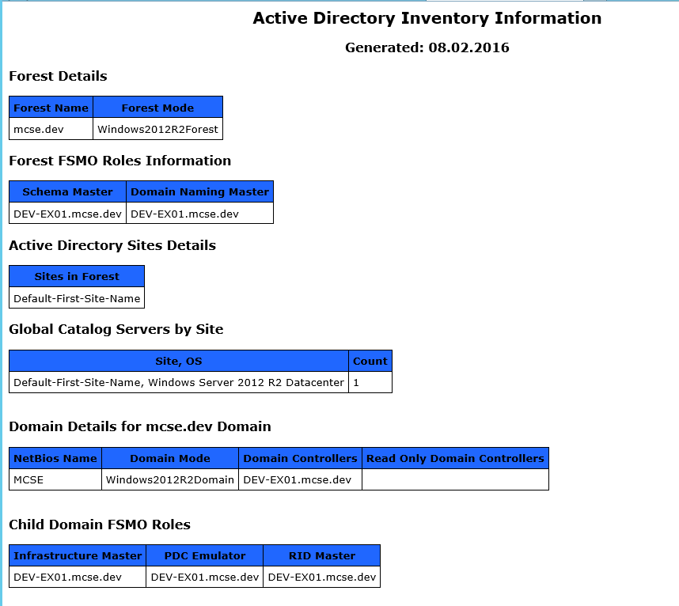

  

#Project HeloCheck Get-ADInventory

Simple PowerShell script that will gather information about an Active Directory instance and produce an inventory HTML file

## Usage

Copy Code and save to .PS1 
Run It! 

## Contributing

1. Fork it!
2. Create your feature branch: `git checkout -b my-new-feature`
3. Commit your changes: `git commit -am 'Add some feature'`
4. Push to the branch: `git push origin my-new-feature`
5. Submit a pull request :D

## History

18.02.2016 - Version 1.0 - Initial Release

## License

MIT License
